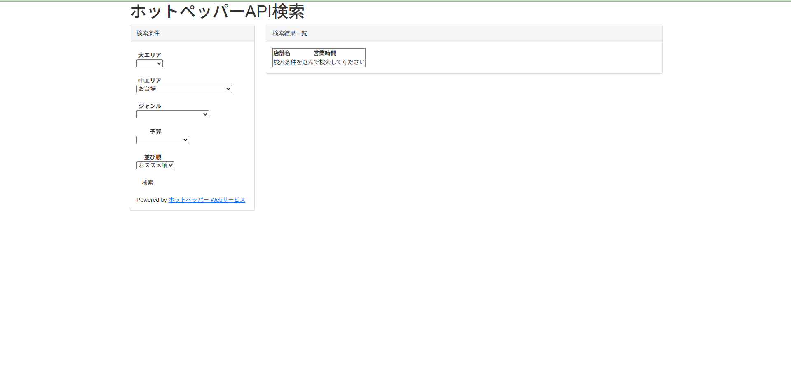
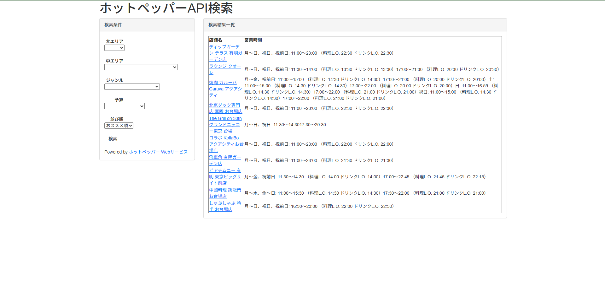

# Hotpepper Search App

Laravel + Guzzle を使用した  
ホットペッパーグルメAPI検索アプリです。

---

## 概要
エリア・ジャンル・予算などの条件を指定して、
飲食店を検索・一覧表示できるWebアプリケーションです。

Qiitaなどを参考に、外部API連携の基礎を学ぶ目的で作成しました。

---

## 使用技術
- PHP
- Laravel
- Guzzle
- Hotpepper Gourmet API
- Blade
- Bootstrap
- jQuery
- Git / GitHub

---

## 主な機能
- 店舗検索（エリア・ジャンル・予算）
- 外部API（ホットペッパー）連携
- 検索結果一覧表示
- 初期表示・未検索時のエラーハンドリング

---

## 画面イメージ



---

## セットアップ方法

```bash
git clone https://github.com/ユーザー名/hotpepper-laravel.git
cd hotpepper-laravel
composer install
cp .env.example .env
php artisan key:generate

.env ファイルに以下を設定してください。
HOTPEPPER_API_KEY=your_api_key

アプリケーションキーの生成
php artisan key:generate

サーバー起動
php artisan serve

ブラウザで以下にアクセスしてください。
http://127.0.0.1:8000
